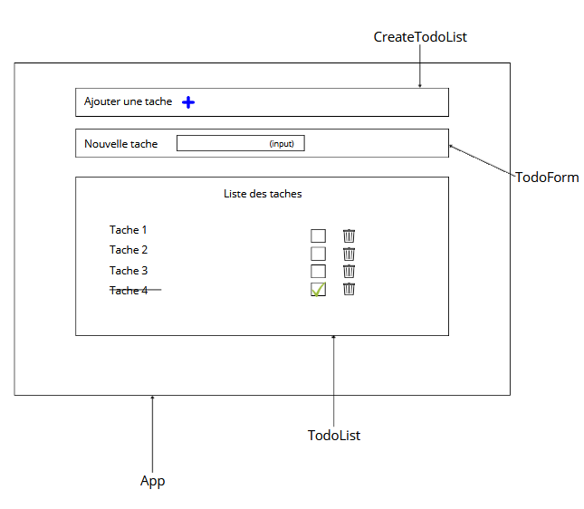

# Documentation de l'Application TodoList

## Table des Matières

- [App](#app)
- [CreateTodoList](#createtodolist)
- [TodoForm](#todoform)
- [TodoList](#todolist)

---

## App

### Description

Le composant `App` sert de racine pour l'application TodoList. Il gère l'état global des tâches et leur affichage.

### Fonctions

#### useState

`useState` est un Hook de React utilisé pour ajouter un état local au composant. Dans `App`, il maintient la liste des tâches (`todos`).

```
const [todos, setTodos] = useState([]);
```

- `todos` : la liste actuelle des tâches.
- `setTodos` : fonction pour mettre à jour la liste des tâches.

#### completedCount

Calcule le nombre de tâches complétées.

```
const completedCount = todos.filter(todo => todo.completed).length;
```

- Utilise `filter` pour sélectionner les tâches complétées (`todo.completed` est `true`).
- `length` retourne le nombre de ces tâches.

---

## CreateTodoList

### Description

`CreateTodoList` gère l'affichage et la logique de création de nouvelles tâches.

### État

#### useState pour showForm

Contrôle l'affichage du formulaire de création de tâches.

```
const [showForm, setShowForm] = useState(false);
```

- `showForm` : booléen qui détermine si le formulaire doit être affiché.
- `setShowForm` : fonction pour changer l'état de `showForm`.

---

## TodoForm

### Description

`TodoForm` est un composant pour saisir et ajouter une nouvelle tâche.

### Fonctions

#### handleSubmit

Gère la soumission du formulaire.

```
const handleSubmit = (e) => {
e.preventDefault();
// Logique pour ajouter la tâche
};
```

- Empêche le comportement par défaut du formulaire (rechargement de la page).
- Ajoute une nouvelle tâche à la liste si les critères sont remplis.

---

## TodoList

### Description

`TodoList` affiche la liste des tâches et permet de les marquer comme complétées ou de les supprimer.

### Fonctions

#### toggleComplete

Change l'état de complétion d'une tâche.

```
const toggleComplete = (id) => {
// Logique pour changer l'état de complétion
};
```

- Parcourt la liste des tâches et modifie l'état de la tâche concernée.

#### deleteTodo

Supprime une tâche de la liste.

```
const deleteTodo = (id) => {
// Logique pour supprimer la tâche
};
```

- Filtre les tâches et enlève celle dont l'ID correspond.

---
